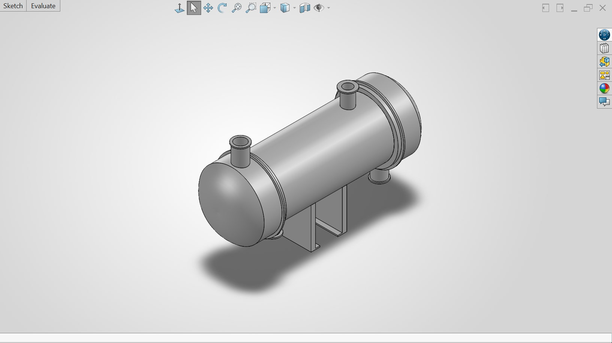
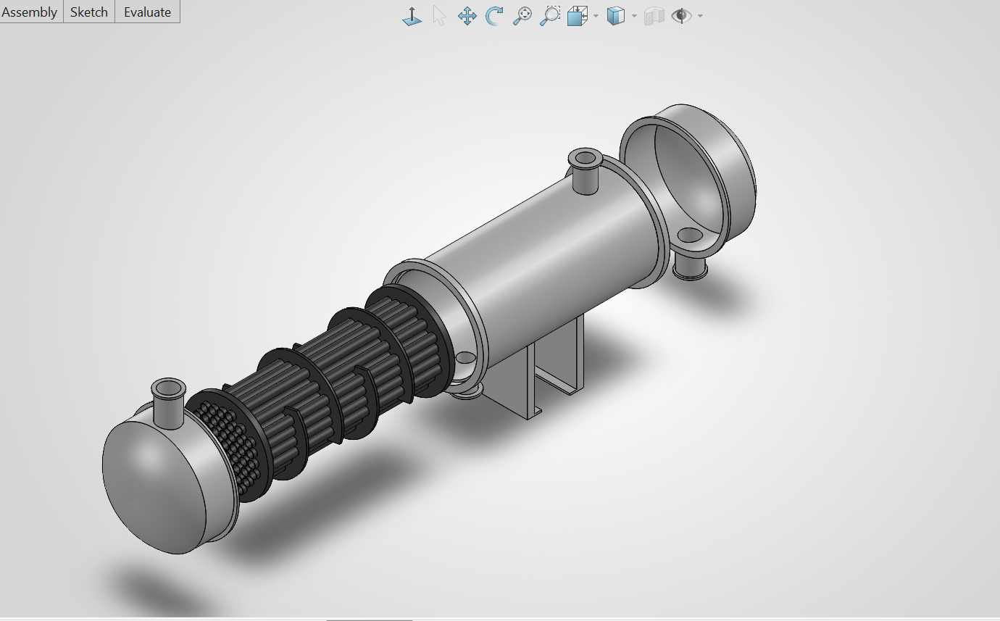

# Shell-and-Tube Heat Exchanger — Design & CAD Model

*Mechanical design, thermal sizing, and 3D CAD modeling of a water-to-water shell-and-tube heat exchanger.*

---

## Overview

This project covers the end-to-end mechanical design of a shell-and-tube heat exchanger from thermal sizing calculations through a fully modeled 3D CAD assembly. The unit transfers heat between a hot water stream (80°C → 50°C) and a cold water stream (20°C → 40°C) in a counter-flow configuration.

## Design Summary

| Parameter | Value |
|---|---|
| Heat duty (Q) | **62.8 kW** |
| LMTD | 34.8 °C |
| Overall U (assumed) | 1000 W/m²·K |
| Required heat transfer area | 1.81 m² |
| Number of tubes | 60 |
| Tube OD | 19.05 mm |
| Tube length | 0.5 m |
| Shell ID (est.) | 245 mm |

Full calculation breakdown → [`design_calcs.ipynb`](./design_calcs.ipynb)

## CAD Model

**Assembly — Isometric View**

**Exploded View**

**Assembly Animation**
[`heat_exchanger_animation.mp4`](./heat_exchanger_animation.mp4) — full mate sequence showing the tube bundle, baffles, shell, and covers assembling.

## Tools Used

- **SolidWorks** assembly modeling, exploded view, mate animation
- **Python** thermal sizing calculations (heat duty, LMTD, tube/shell sizing)

## Next Steps

- [ ] CFD validation using SolidWorks Flow Simulation
- [ ] Detailed manufacturing drawings with GD&T
- [ ] Structural check on tube sheet and baffle spacing

---

*Built as part of ongoing coursework and portfolio development in mechanical/thermal-fluids engineering.*
